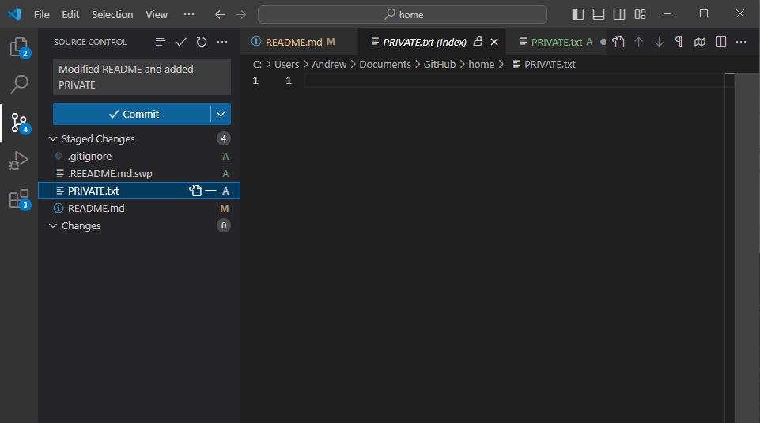

# This is a header.
* This is styled text. *
> This is quoted text.
```
This is quoted code.
```
This is an external link to [GitHub](https://www.github.com)
This is a relative link to [the README](README.md)
- This is an
- unordered List.
1. While this,
2. is an ordered list.
This is an image of me committing changes from VSCode:

- [x] And finally:
- [ ] This is a task list.
- [ ] Which can be checked or unchecked based on completion.

